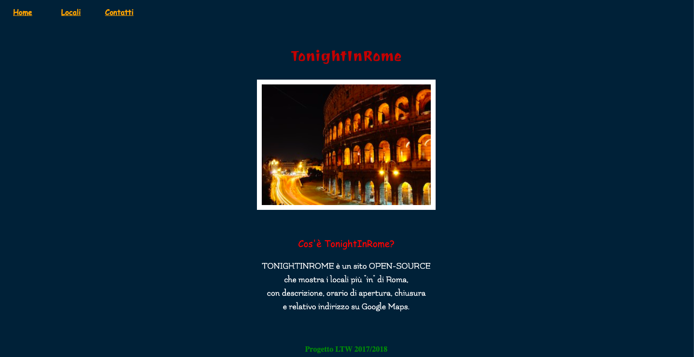
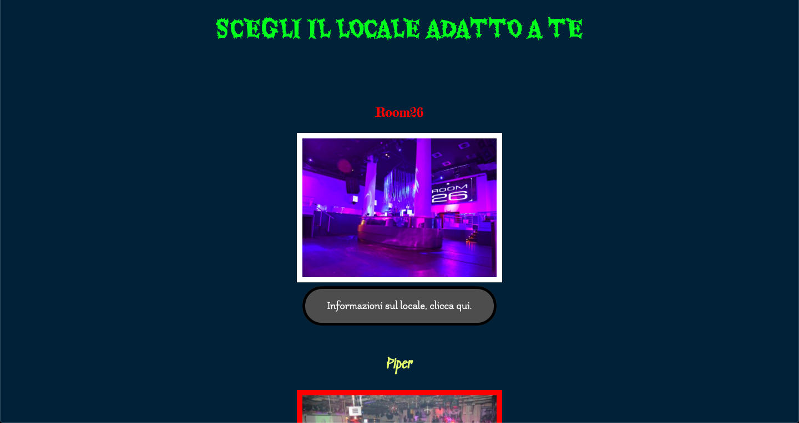
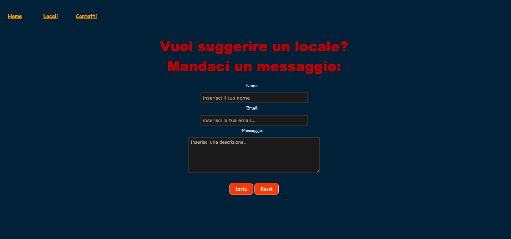

# Progetto LINGUAGGI e TECNOLOGIE PER IL WEB 💯

### Tecnologie utilizzate:
- HTML5
- Javascript
- CSS3 (Bootstrap)
- JQuery
- AJAX

#### In cosa consiste il progetto? 🧉
Il progetto, svolto per un esame universitario, consiste nello sviluppo lato front-end di un sito spaziando sulle varie tecnologie spiegate.
Nello specifico, consiste in un forum dove vengono elencati vari locali notturni nel cuore di Roma con i relativi orari di apertura/chiusura, indirizzo ecc. 

Vi è un campo "*suggerisci*" il quale permette a un utente di suggerire il proprio locale e la possibilità di essere inserito nella sezione "locali" del sito.

Esempio:

  

  

  

